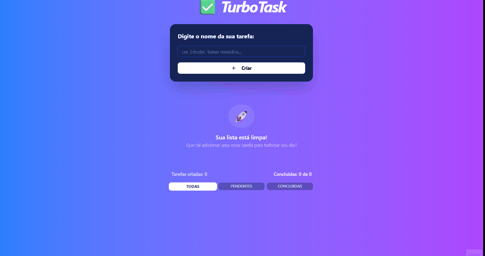
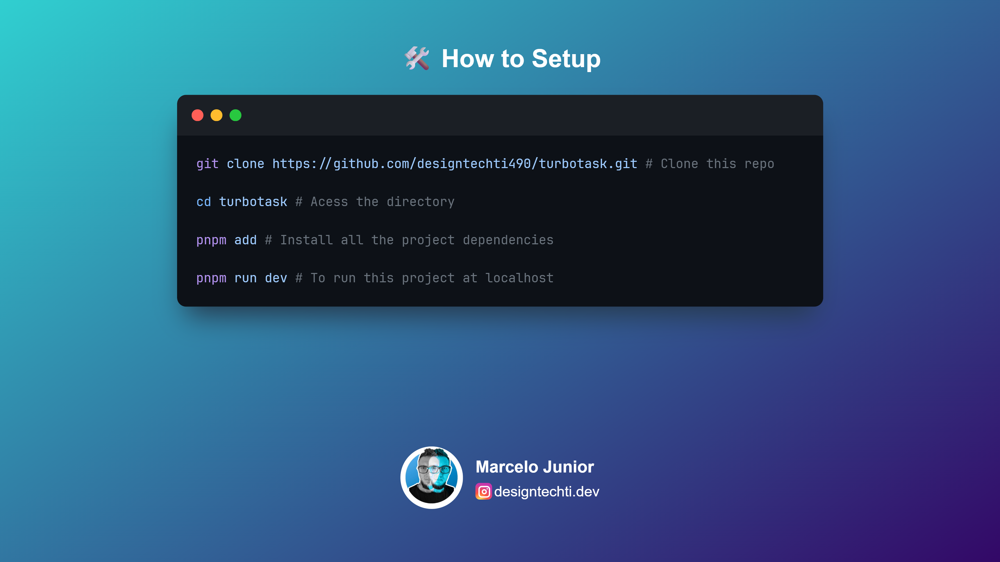

# ✅ TurboTask

TurboTask is a high-performance task manager focused on simplicity and fluidity. Developed with React, TypeScript, and Vite, it offers a modern user experience with smooth animations and data persistence.

## ✨ Features

- **Task CRUD:** Add, list, mark as completed, and delete tasks.
- **Smart Filters:** View all, only pending, or only completed tasks.
- **Local Persistence:** Your data is saved in your browser (LocalStorage).
- **Premium Interface:** Modern design with Glassmorphism and vibrant gradients.
- **Fluid Animations:** Smooth transitions when adding or removing items using Framer Motion.
- **Real-Time Counter:** Track your progress with dynamic statistics.

## 🛠️ Technologies

&nbsp;
&nbsp;
&nbsp;
&nbsp;

## ⚡ How to setup

## Fluxograms

